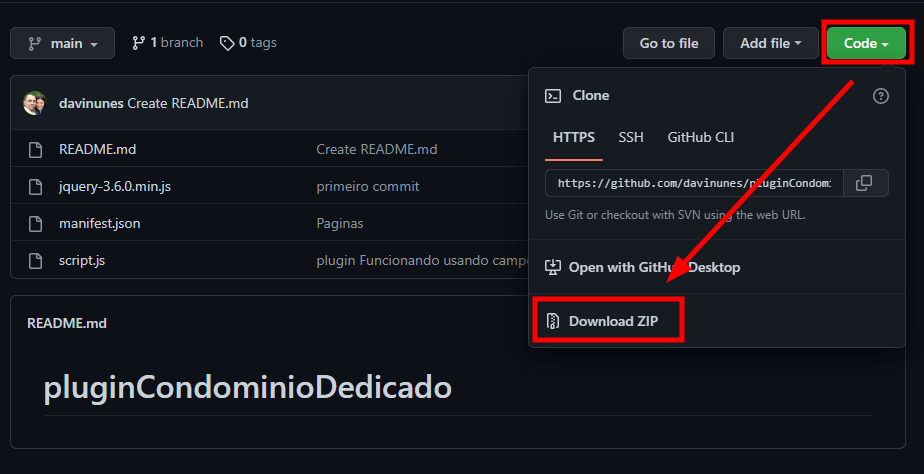

# pluginCondominioDedicado

Faça o Download do pacote zip

Descompate em um local adequado no computador

No Chrome, acesse a URL [chrome://extensions/](chrome://extensions/)

Ative o modo desenvolvedor e depois clique em carregar descompactado

Nevegue até a pasta onde descompactou a extensão

